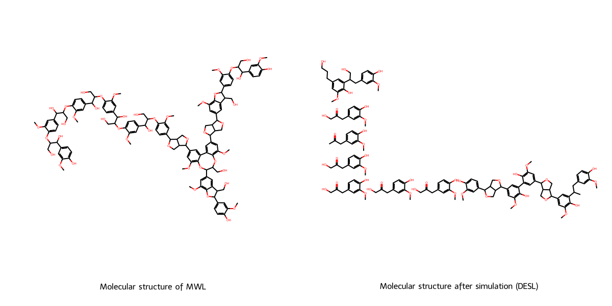

# DES Lignin Simulation Tool

This repository contains a script that simulates the decomposition of Milled Wood Lignin (MWL) into Deep Eutectic Solvent Lignin (DESL) fragments. The script also computes various molecular characteristics for both the MWL and DESL structures, including molecular weight, functional groups, and poly dispersity index (PDI). Additionally, it provides molecular visualizations to aid in understanding the decomposition process.
Features

- **Molecular Simulation:** Decomposes MWL structure into DESL fragments using a simulation function.
- **Molecular Characteristics:** Computes important molecular properties like molecular weight, functional groups, and poly dispersity index (PDI).
- **SMILES Representation:** Takes MWL as input in SMILES format and outputs the decomposed DESL structure in SMILES format.
- **Modular Functions:** Custom functions for functional group counting, PDI calculation, and simulation of decomposition.
- **Visualization:** Draws molecular structures of MWL and DESL using RDKit.

## **Requirements**

Python 3.x
Required libraries:

- rdkit: For molecular manipulation and visualization.
- utils.desl_simulation: A custom module containing functions for simulation and analysis.

To install the required libraries, you can use pip:
pip install -r requirements.txt

**Running the script:**
You can use the attached `desl-simulation.ipynb` Jupyter Notebook to run the script interactively. The notebook allows you to execute the script step-by-step in a more interactive environment.
Alternatively, you can run the script directly in a Python environment by executing: `python your_script.py`
This will display the molecular characteristics of both MWL and DESL, as well as the visualization of the molecular structures.

- Input:The input for the script is the SMILES string representing the MWL structure. You can modify the smile variable in the script with any valid SMILES string to simulate different lignin structures.
- Output:
  The script outputs the following:
  SMILES string of the MWL and DESL structures.
  Molecular weight of both MWL and DESL.
  Count of functional groups in MWL and DESL.
  Poly dispersity index (PDI) for MWL and DESL.
  Visualization of MWL and DESL structures displayed as a grid image.

**Example Output**

### DES Lignin : Simulation Model

#### INPUT

Molecular structure of MWL (SMILES) :

```markdown
COc1cc(C(O)C(CO)Oc2ccc(C(O)C(CO)Oc3ccc(C(O)C(CO)Oc4ccc(C(O)C(CO)Oc5ccc(C(O)C(CO)Oc6ccc(C7OCC8C(c9cc(OC)c%10c(c9)-c9cc(C%11OCC%12C(c%13cc(OC)c%14c(c%13)C(CO)C(c%13ccc(OC(CO)C(O)c%15ccc(O)c(OC)c%15)c(OC)c%13)O%14)OCC%11%12)cc(OC)c9OC(CO)C(c9cc(OC)c%11c(c9)C(CO)C(c9ccc(O)c(OC)c9)O%11)O%10)OCC78)cc6OC)cc5OC)cc4OC)cc3OC)cc2OC)ccc1O
```

Molecular weight (g/mol)           : 2424

Functional group                   : {'ether': 10, 'carbonyl': 0, 'methoxy': 13, 'phenolicOH': 3, 'aliphaticOH_secondary': 6, 'aliphaticOH_primary': 9, 'cinnamyl_alcohol': 0}

Poly dispersity index (PDI)        : 1.0

#### OUTPUT

Number of fragments  : 8

Molecular structure of DESL fragments (SMILES)

```markdown
COc1cc(CC(=O)CO)ccc1O
COc1cc(CC(=O)CO)ccc1O
COc1cc(CC(=O)CO)ccc1O
COc1cc(CC(C)=O)ccc1O
COc1cc(CC(=O)CO)ccc1O
COc1cc(CC(=O)CO)ccc1O
COc1cc(CC(CO)c2cc(CCCO)cc(OC)c2O)ccc1O
COc1cc(CC(C)c2cc(C3OCC4C(c5cc(OC)c(O)c(-c6cc(C7OCC8C(c9ccc(O)c(OC)c9)OCC78)cc(OC)c6O)c5)OCC34)cc(OC)c2O)ccc1O
```

Total Molecular weight (g/mol) of all fragments : 2400

Functional group                                 : {'ether': 0, 'carbonyl': 6, 'methoxy': 13, 'phenolicOH': 13, 'aliphaticOH_secondary': 0, 'aliphaticOH_primary': 7, 'cinnamyl_alcohol': 0}

Poly dispersity index (PDI)                      : 1.6

**Visualization:**
The script also generates and displays a grid image of the MWL and DESL fragments molecular structures.



<hr/>
Feel free to fork this repository, submit issues, or send pull requests to improve the simulation and the overall functionality of the script.
